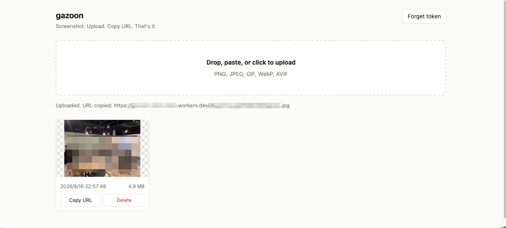
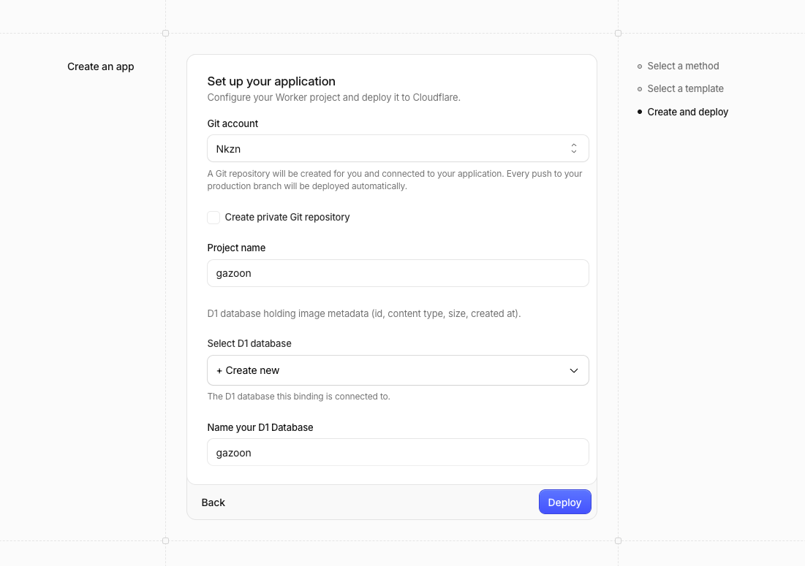
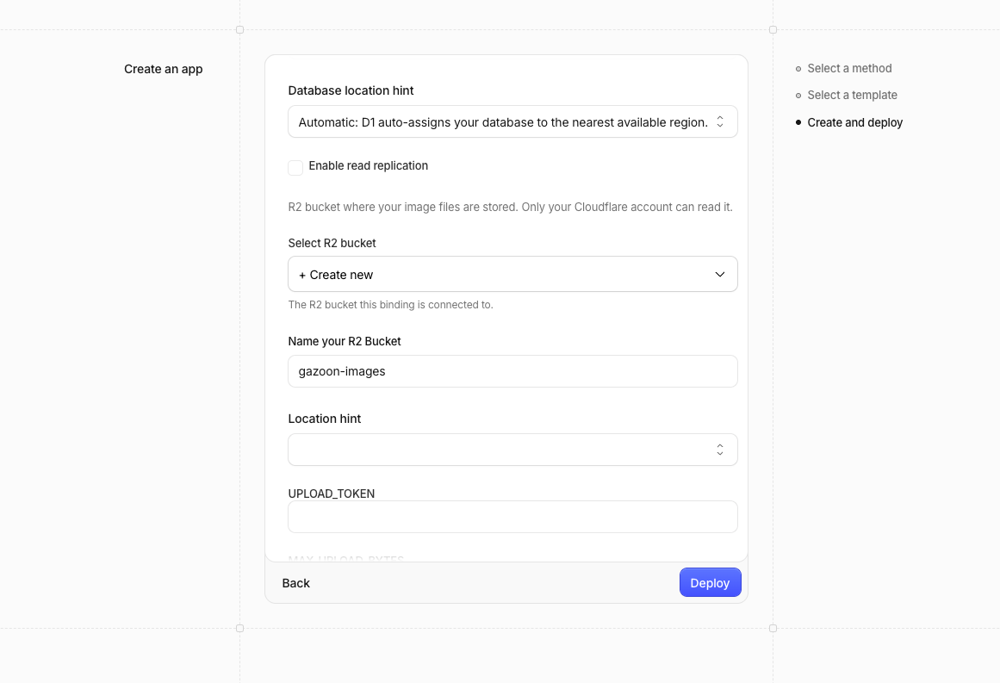
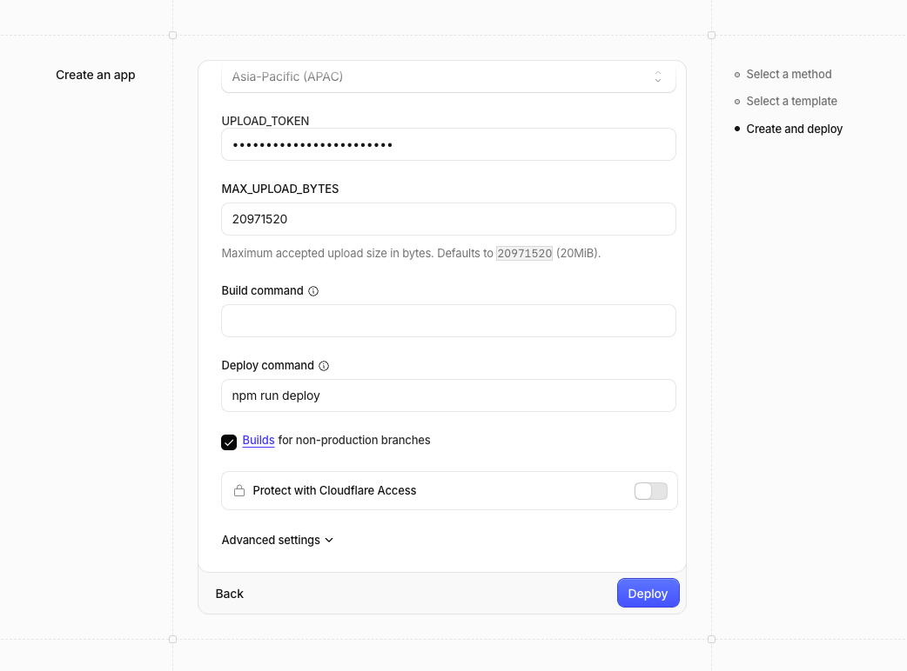
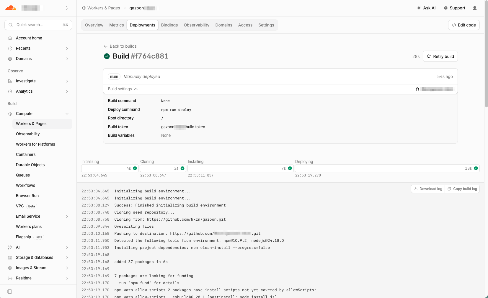
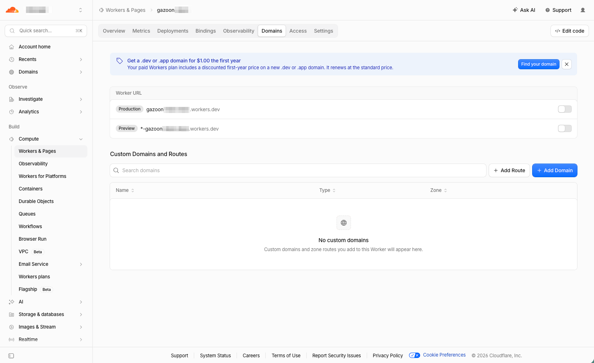
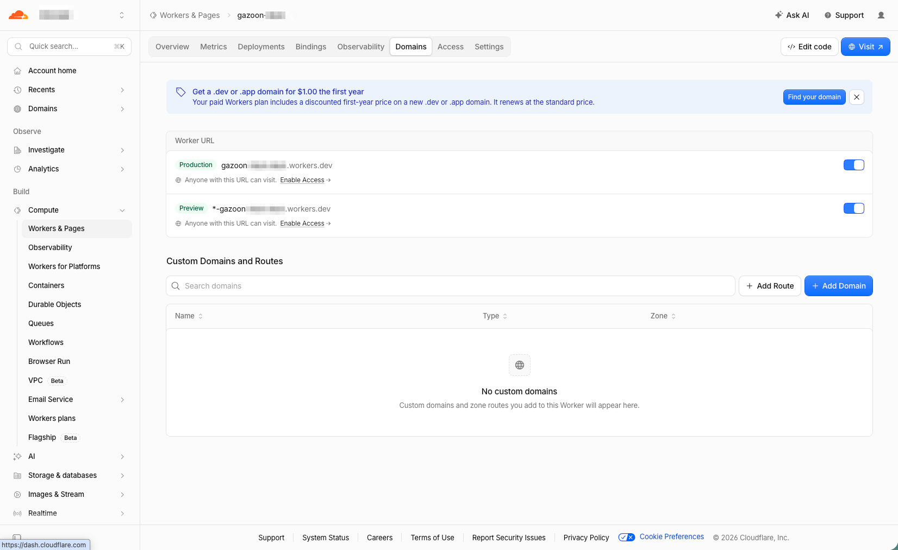
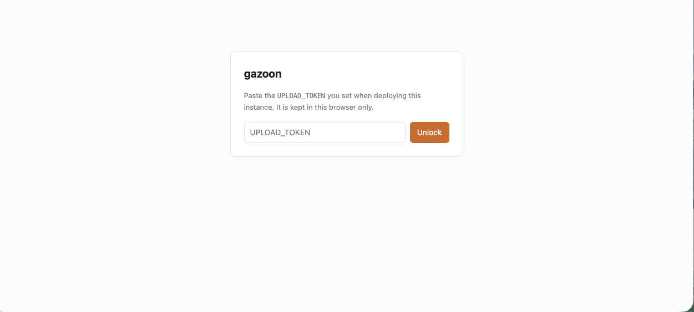
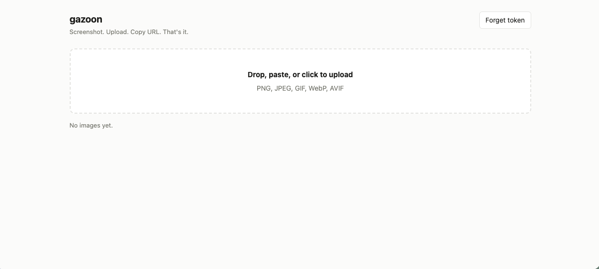

# gazoon

Images on Your R2.

[日本語版はこちら](README.md)

**Screenshot. Upload. Copy URL. That's it.** — but the images live in *your*
Cloudflare account, not somebody else's. There is no gazoon service and no
gazoon operator: you deploy your own instance, and nobody but you can read the
bucket it writes to.

[](https://deploy.workers.cloudflare.com/?url=https://github.com/Nkzn/gazoon)



## What you get

- Drop, paste, or pick an image in the browser → it uploads and the URL lands on
  your clipboard.
- A list of everything you have uploaded, with one-click copy and delete.
- Direct image URLs (`/i/<id>.jpg`) you can paste anywhere.

## Why run your own

Every hosted screenshot service asks you to trust an operator with a pile of
images you stopped thinking about years ago. Sooner or later that trust gets
tested.

gazoon does not ask. The Worker, the R2 bucket and the D1 database are created
in your own Cloudflare account, and the only credential is a token you generate
yourself. There is no central instance to breach and no operator account to
compromise.

It costs whatever Cloudflare charges you. Workers, R2 and D1 all have free
allowances, but what you actually pay depends on how you use them, and the
pricing itself changes — so this README will not promise you a number. Check the
current terms for
[Workers](https://developers.cloudflare.com/workers/platform/pricing/),
[R2](https://developers.cloudflare.com/r2/pricing/) and
[D1](https://developers.cloudflare.com/d1/platform/pricing/). Note that R2 needs
a payment method on the account before it can be used at all.

## Deploy it

Press the button above. Cloudflare copies this repository into your own GitHub
or GitLab account, provisions the resources, and deploys the Worker. The whole
thing takes about a minute.

If your Cloudflare account has never used R2, enable it in the dashboard first
so the bucket can be created.

### 1. Name the project

Pick a Git account and a project name. The D1 database that holds image metadata
is created for you — leave it on **Create new**.



### 2. Name the bucket

Same again for the R2 bucket that will hold the image files themselves.



### 3. Set the upload token

Generate a token and paste it into `UPLOAD_TOKEN`:

```sh
openssl rand -hex 32
```

This is the only credential your instance has. Anyone holding it can upload to,
list and delete from your instance, so treat it like a password.

Leave **Protect with Cloudflare Access** off. It guards the whole hostname,
which would put a login in front of your image links as well — see
[After deploying](#after-deploying) for the way to add Access without breaking
them.



### 4. Wait for the build

`npm run deploy` applies the database migrations and then deploys. A first build
takes well under a minute.



### 5. Turn the Worker URL on

Cloudflare has been observed creating the Worker with its URL switched off, so a
successful deploy can still leave you with nothing to open. This is what that
looks like — the toggles on the right are off:



Switch the production Worker URL on, and the URL starts answering:



## First run

Open your `*.workers.dev` URL and paste the same token you set during setup. It
is kept in that browser's `localStorage` and sent as a bearer token from then
on; it never goes anywhere but your own instance.



Then drop an image on the box, paste one from the clipboard, or click to pick a
file. The URL is copied for you as soon as the upload finishes.



That URL works for anyone you send it to, with no login — which is the whole
point. Try it in a private window.

## After deploying

- **Custom domain.** Add a route to the Worker in the dashboard. This is not
  configured automatically, because the deploy button cannot know which zone you
  own.
- **Cloudflare Access.** Put a Zero Trust policy on `/` and `/api/*` so the
  admin UI needs your identity as well as the token. Scope it by path and leave
  `/i/*` out, or your image links stop working for everyone else — which is why
  the whole-hostname toggle in the deploy flow is the wrong tool here.
- **Preview URLs.** The deploy flow also exposes `*-<worker>.workers.dev` for
  non-production branches, bound to the same bucket and database. Turn it off
  under **Domains** if you do not want a second public hostname serving your
  images.
- **Rotate the token.** `wrangler secret put UPLOAD_TOKEN`, then re-enter it in
  the UI.

## Security notes

These are the properties the project is actually trying to hold, so they are
worth stating plainly:

- **IDs are 128 bits of CSPRNG output**, URL-safe, 22 characters. Image URLs are
  unguessable; that is what makes an unlisted URL safe to paste.
- **Image URLs are public and permanent** until you delete them. Anyone with the
  link can view the image — that is the point — but nothing enumerates them.
- **Listing and deletion require the token.** Only you see the list.
- **The declared content type is ignored.** Uploads are identified by their
  magic bytes, and only PNG, JPEG, GIF, WebP and AVIF are stored. SVG is
  rejected on purpose: it can carry scripts, and images are served from the same
  origin as the UI that holds your token.
- Responses on `/i/*` carry `X-Content-Type-Options: nosniff` and a
  `default-src 'none'; sandbox` CSP.
- The original filename is never used as a storage key, and EXIF is not yet
  stripped — see below.

## Not there yet

v0.1 is deliberately small. Planned next:

- A desktop capture client: hotkey → select region → upload → URL on clipboard.
- EXIF stripping on upload.
- `private` / `unlisted` distinction and expiring URLs.
- Browser extension.

## Local development

```sh
npm install
cp .dev.vars.example .dev.vars   # then fill in UPLOAD_TOKEN
npm run db:migrations:apply:local
npm run dev
```

Upload from a shell:

```sh
curl -X POST http://localhost:8787/api/upload \
  -H "Authorization: Bearer $UPLOAD_TOKEN" \
  -H "Content-Type: image/png" \
  --data-binary @screenshot.png
```

## License

MIT

## Buy me a coffee

gazoon is free and always self-hosted, so there is nothing to sell you. If it
saves you from paying someone else to hold your screenshots, a coffee is a nice
way to say thanks.

[](https://buymeacoffee.com/nkzn)
